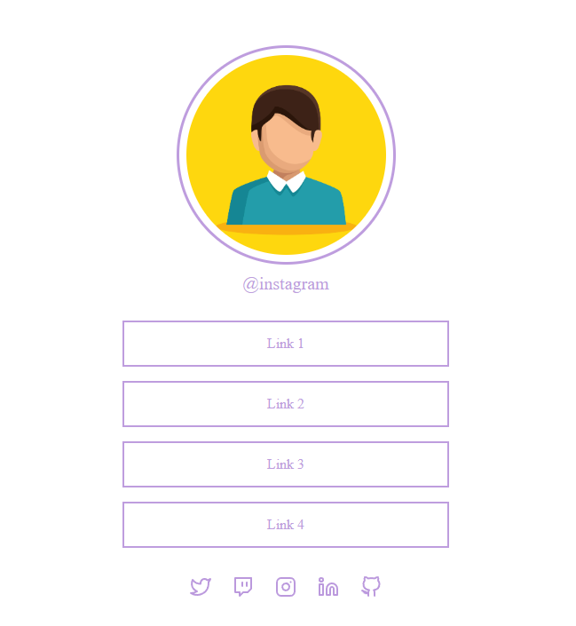

# Social Tree

Social Tree é uma página HTML simples que apresenta um layout elegante e interativo para exibir informações e links de redes sociais de um usuário. O código HTML é responsivo e projetado para funcionar em diferentes tamanhos de tela, tornando-o adequado para visualização em dispositivos móveis e computadores.

[Demonstração](https://italofvm.github.io/Social_Tree/)

## Estrutura do Código

O arquivo HTML possui a seguinte estrutura:

1. **Metadados e Título:** Essa seção define a codificação do caractere, a configuração da visualização para dispositivos móveis e o título da página.
2. **Corpo do Documento:** O corpo do documento contém o conteúdo visível da página.
3. **Seção:** A seção principal contém três partes: imagem do usuário, links e ícones de redes sociais.
    * **Imagem e Link do Usuário:** Nessa parte, exibe-se uma imagem do usuário e um link para o perfil do usuário no Instagram.
    * **Links:** Essa seção contém uma lista de links (Link 1, Link 2, Link 3, Link 4). O usuário pode personalizar esses links conforme sua preferência.
    * **Ícones de Redes Sociais:** Aqui, são exibidos ícones de redes sociais, como Twitter, Twitch, Instagram, LinkedIn e GitHub, cada um com seu respectivo link.

## Estilos
O arquivo `style.css` contém estilos personalizados que tornam a página mais atraente e interativa. Aqui estão alguns dos principais estilos aplicados:

* O corpo da página é centralizado e ocupa a altura total da janela de visualização.
* A seção principal é organizada em uma coluna e centralizada.
* A imagem do usuário possui uma borda circular e é envolvida por uma moldura colorida.
* Os links são exibidos em formato de lista, com uma borda e cor personalizadas. Ao passar o mouse sobre os links, o fundo e a cor do texto mudam para um efeito de destaque.
* Os ícones de redes sociais têm um efeito de animação ao passar o mouse, elevando-se levemente.
* O layout é responsivo, ajustando-se automaticamente para tamanhos de tela menores (como em dispositivos móveis).
  
## Personalização

Para personalizar a página "Social Tree" para o seu próprio perfil ou necessidades, siga os passos abaixo:

1. Substitua a imagem do avatar: Coloque a imagem do seu avatar no lugar de `assets/avatar.jpg`.
2. Atualize o link do Instagram: No atributo `href` do link do Instagram, substitua `https://www.instagram.com` pelo URL do seu perfil no Instagram.
3. Edite os links: Na seção de links, altere os textos ´Link 1´, ´Link 2´ etc... , e adicione os links relevantes que deseja exibir.
4. Redes sociais: Altere os links das redes sociais e os caminhos das imagens dos ícones para refletir suas próprias contas.
   
## Contato

Caso queira entrar em contato comigo ou saber mais sobre meu trabalho, você pode encontrar-me nos seguintes canais:

- Email: italofernandesvm@gmail.com
- GitHub: [github.com/italofvm](https://github.com/italofvm)
- LinkedIn: [linkedin.com/in/italovm](https://www.linkedin.com/in/italovm/)

---

* Social Tree foi desenvolvido por [Italo Vieira](https://www.linkedin.com/in/italovm).